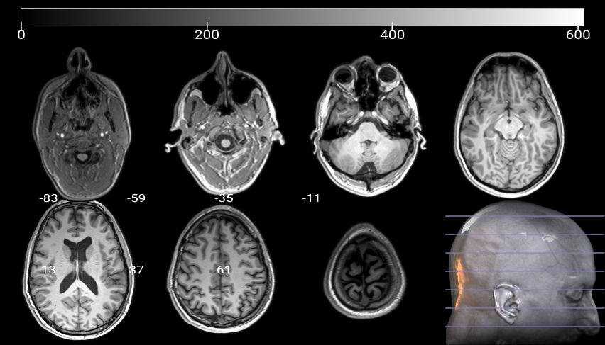

# Siemens Prisma MPRAGE

Sample MPRAGE acquisition from a Siemens Prisma.

## General Information

|      Tag     | Name                      | Value                 |
|:------------:|---------------------------|-----------------------|
| (0008, 0060) | Modality                  | "MR"                  |
| (0008, 0070) | Manufacturer              | "SIEMENS"             |
| (0008, 0080) | Institution Name          | "Tel-Aviv University" |
| (0008, 1090) | Manufacturer's Model Name | "Prisma"              |
| (0018, 0087) | Magnetic Field Strength   | "3.0"                 |
| (0018, 1020) | Software Versions         | "syngo MR E11"        |

## Patient Information

|      Tag     | Name                 | Value      |
|:------------:|----------------------|------------|
| (0010, 0010) | Patient's Name       | "Doe^John" |
| (0010, 0020) | Patient ID           | "0123"     |
| (0010, 0030) | Patient's Birth Date | "19901214" |
| (0010, 0040) | Patient's Sex        | "M"        |
| (0010, 1010) | Patient's Age        | "027Y"     |
| (0010, 1020) | Patient's Size       | "1.86"     |
| (0010, 1030) | Patient's Weight     | "67.0"     |

## Series Information

|      Tag     | Name               | Value                          |
|:------------:|--------------------|--------------------------------|
| (0008, 0021) | Series Date        | "20180501"                     |
| (0008, 0031) | Series Time        | "123458.325000"                |
| (0008, 103E) | Series Description | "MPRAGE_EnchancedContrast"     |

### Acquisition Parameters

|      Tag     | Name                              | Value              |
|:------------:|-----------------------------------|--------------------|
| (0018, 0015) | Body Part Examined                | "BRAIN"            |
| (0018, 0020) | Scanning Sequence                 | ["GR", "IR"]       |
| (0018, 0021) | Sequence Variant                  | ["SK", "SP", "MP"] |
| (0018, 0022) | Scan Options                      | "IR"               |
| (0018, 0023) | MR Acquisition Type               | "3D"               |
| (0018, 0024) | Sequence Name                     | "*tfl3d1_16"       |
| (0018, 0025) | Angio Flag                        | "N"                |
| (0018, 0050) | Slice Thickness                   | "1.0"              |
| (0018, 0080) | Repetition Time                   | "2530.0"           |
| (0018, 0081) | Echo Time                         | "2.88"             |
| (0018, 0082) | Inversion Time                    | "1100.0"           |
| (0018, 0091) | Echo Train Length                 | "1"                |
| (0018, 0093) | Percent Sampling                  | "100.0"            |
| (0018, 0094) | Percent Phase Field of View       | "100.0"            |
| (0018, 0095) | Pixel Bandwidth                   | "180.0"            |
| (0018, 1310) | Acquisition Matrix                | [224, 0, 0, 224]   |
| (0018, 1312) | In-plane Phase Encoding Direction | "COL"              |
| (0018, 1314) | Flip Angle                        | "7.0"              |
| (0018, 5100) | Patient Position                  | "HFS"              |
| (0028, 0010) | Rows                              | 224                |
| (0028, 0011) | Columns                           | 224                |
| (0028, 0030) | Pixel Spacing                     | [1, 1]             |